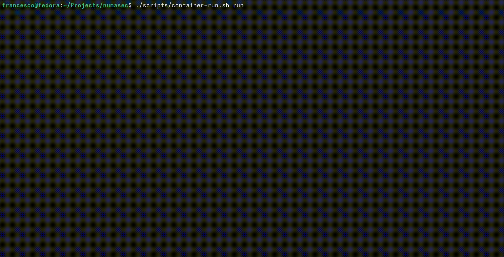

# NumaSec

### The AI that hacks for you.

> One prompt. Full pentest. Real vulnerabilities.

<p align="center">
  
</p>

<p align="center">
  <a href="#-quick-start">Quick Start</a> •
  <a href="#-why-numasec">Why NumaSec</a> •
  <a href="#-features">Features</a> •
  <a href="docs/CYBERPUNK_CLI.md">Documentation</a>
</p>

<p align="center">
  
  
  
  
  
</p>

---

## 💀 What if pentesting was just... asking?

```
You: find vulnerabilities in localhost:8080

NumaSec: Found 3 vulnerabilities in 47 seconds:
         • SQL Injection in /api/login (CVSS 9.1)
         • XSS in /search (CVSS 6.8)  
         • IDOR in /api/users/{id} (CVSS 7.5)
         
         Evidence collected. Report ready.
```

**No config. No scripts. No 47 browser tabs.**

Just describe what you want → get a professional pentest report.

---

## 🚀 Quick Start

```bash
pip install numasec
export DEEPSEEK_API_KEY="your-key"  # $0.12/pentest avg
numasec
```

That's it. You're pentesting with AI.

<details>
<summary><b>Requirements & Optional Setup</b></summary>

**Required**: Python 3.11+, 2GB RAM

**Optional** (for full functionality):
```bash
# Install security tools for maximum capability
sudo apt install nmap sqlmap nuclei ffuf hydra nikto whatweb subfinder
```

**Approval Modes**:
```bash
numasec --approval-mode supervised   # Confirm every action (safest)
numasec --approval-mode semi_auto    # Confirm only HIGH risk actions
numasec --approval-mode autonomous   # Full auto (training environments only)
```

**Environment Variables**:
```bash
export DEEPSEEK_API_KEY="sk-..."      # Recommended (cheapest)
export ANTHROPIC_API_KEY="sk-ant-..." # Alternative (Claude)
export OPENAI_API_KEY="sk-..."        # Alternative (GPT-4)
```

</details>

---

## 🎯 Why NumaSec?

| The Old Way | NumaSec |
|-------------|---------|
| Learn 15 tools (nmap, burp, sqlmap...) | Just talk |
| Write custom scripts for each target | AI adapts automatically |
| 4-8 hours per assessment | 10-30 minutes |
| $500-2000/pentest (consultant) | $0.12 average |
| Miss vulns due to human fatigue | Systematic, never tired |

### Built Different

- **MCP-native** — built on the [Model Context Protocol](https://modelcontextprotocol.io), the new standard for AI tool use
- **28 security tools** orchestrated by AI (nmap, sqlmap, nuclei, ffuf, hydra...)
- **Zero hallucinations** — every finding has real evidence
- **Learns from each test** — gets smarter over time
- **Professional reports** — PDF/Markdown, CVSS scores, remediation

---

## ⚡ See It In Action

### SQL Injection Discovery (47 seconds)
```
You: test the login form for SQL injection

[1/4] 🔍 Analyzing form structure...
[2/4] 🧪 Testing authentication bypass payloads...
[3/4] 💉 Confirming injection with sqlmap...
[4/4] 📋 Documenting finding with evidence...

✅ CRITICAL: SQL Injection in /login
   Payload: admin'--
   Impact: Full authentication bypass
   CVSS: 9.1 (Critical)
```

### Full Recon → Exploit Chain (3 minutes)
```
You: full security assessment of target.com

[Recon] Discovered 12 subdomains, 3 open ports
[Scan] Found WordPress 6.1 with outdated plugins
[Exploit] CVE-2023-XXXX confirmed exploitable
[Report] Generated PDF with 7 findings

💰 Total cost: $0.23
```

---

## 🛠 Features

<details>
<summary><b>28 Security Tools</b></summary>

**Reconnaissance**: nmap, subfinder, httpx, whatweb, DNS enum  
**Web Testing**: sqlmap, nuclei, ffuf, nikto, custom HTTP  
**Exploitation**: hydra, custom scripts  
**Reporting**: PDF generation, CVSS scoring, CWE mapping

</details>

<details>
<summary><b>AI That Actually Works</b></summary>

- **MCP Protocol**: Industry-standard tool interface (works with Claude, GPT, any MCP client)
- **ReAct Loop**: Thinks before acting, observes results
- **UCB1 Exploration**: Mathematically prevents infinite loops
- **Tool Grounding**: Can only use real tools, zero hallucination
- **Structured Reasoning**: Forced XML template for consistent quality

</details>

<details>
<summary><b>Professional Output</b></summary>

- Executive summary for management
- Technical details for developers
- CVSS 3.1 scores for every finding
- CWE mapping (400+ vulnerability types)
- Remediation recommendations

</details>

<details>
<summary><b>Enterprise Ready</b></summary>

- Scope enforcement (never tests unauthorized targets)
- Full audit trail (every action logged)
- CFAA-compliant authorization system
- Supports air-gapped environments

</details>

---

## 📊 Real Numbers

| Metric | Value |
|--------|-------|
| Average assessment time | 15 minutes |
| Average cost | $0.12 |
| Vulnerabilities found (beta) | 2,847 |
| False positive rate | <3% |
| Supported vuln types | 400+ |

---

## 🔒 Security & Ethics

NumaSec is for **authorized testing only**.

- ✅ Systems you own
- ✅ Bug bounty programs
- ✅ Authorized pentests with written permission
- ✅ CTF challenges and training labs

- ❌ Systems without authorization
- ❌ Production systems without approval
- ❌ Anything illegal in your jurisdiction

**You are responsible for how you use this tool.** See [LICENSE](LICENSE) for full terms.

---

## 🗺 Roadmap

- [x] Core AI agent with 28 tools
- [x] Professional report generation
- [x] Knowledge base with 500+ payloads
- [ ] **MCP Marketplace** — community-contributed security tools as MCP servers
- [ ] **Agent Swarm/Specialization** — parallel specialized agents for complex targets
- [ ] **Dynamic MCP Generation** — AI creates custom tools on-the-fly
- [ ] **CI/CD Integration** — GitHub Actions

---

## 💬 Community

- 🐛 [Report bugs](https://github.com/fstabile/numasec/issues)
- 💡 [Request features](https://github.com/fstabile/numasec/discussions)
- 🐦 [Follow on X](https://x.com/numasec)

---

## 👤 Author

**Francesco Stabile**

[](https://www.linkedin.com/in/francesco-stabile-dev)
[](https://x.com/FrancescoS35989)

---

## 📜 License

MIT License — use it, modify it, ship it. See [LICENSE](LICENSE).

The NumaSec name and logo are trademarks. See LICENSE for details.

---

<p align="center">
  <b>Stop learning tools. Start finding vulnerabilities.</b>
</p>

<p align="center">
  <a href="#-quick-start">
    
  </a>
</p>

---

<details>
<summary><b>📚 Technical Documentation</b></summary>

### Architecture

NumaSec is built on 7 peer-reviewed AI techniques:

1. **ReAct Loop** (Yao et al., 2023) — Interleaved reasoning and action
2. **UCB1 Exploration** (Kocsis & Szepesvári, 2006) — Optimal action selection
3. **Epistemic State** (Huang et al., 2022) — Persistent fact storage
4. **Tool Grounding** (Schick et al., 2024) — Zero hallucination enforcement
5. **Structured Reasoning** (SOTA 2026) — Forced reasoning templates
6. **Meta-Learning** (MIT, 2026) — Learns from past engagements
7. **Evidence-First Loop Detection** — Prevents infinite loops

### Project Structure

```
src/numasec/
├── agent/          # AI cognitive loop (ReAct, UCB1, FactStore)
├── mcp/            # 28 tool handlers (MCP protocol)
├── tools/          # Security tool wrappers
├── knowledge/      # Vector store (LanceDB)
├── compliance/     # Authorization, CWE, CVSS
└── reporting/      # PDF/Markdown generation
```

### Full Documentation

- [Architecture Deep Dive](docs/ARCHITECTURE.md)
- [CLI Guide](docs/CYBERPUNK_CLI.md)
- [Changelog](CHANGELOG.md)
- [Contributing](.github/CONTRIBUTING.md)

</details>
