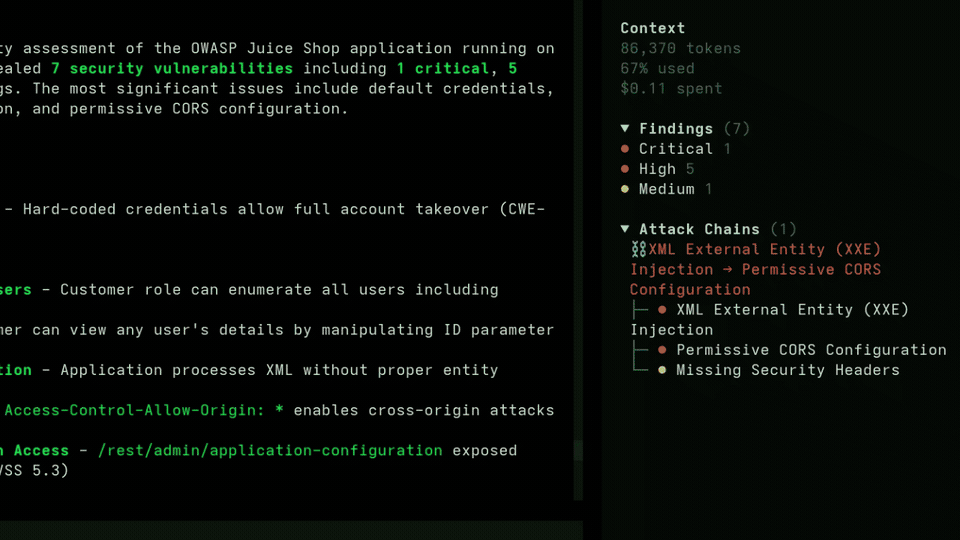
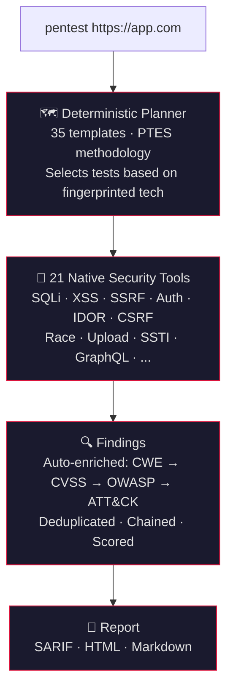

<h1 align="center">numasec</h1>
<h3 align="center">The AI agent for security. Like Claude Code, but for pentesting.</h3>

<p align="center">
  
</p>

<p align="center">
  <a href="https://github.com/FrancescoStabile/numasec/stargazers"></a>
  <a href="#why-numasec"></a>
  <a href="LICENSE"></a>
  <a href="https://github.com/FrancescoStabile/numasec/actions/workflows/ci.yml"></a>
  <a href="https://github.com/FrancescoStabile/numasec/releases/latest"></a>
</p>

<p align="center">
  21 native security tools · 35 attack templates · 60+ LLM providers · open source
</p>

---

## Table of Contents

- [Quickstart](#quickstart)
- [Why numasec](#why-numasec)
- [What it finds](#what-it-finds)
- [How it works](#how-it-works)
- [LLM Providers](#llm-providers)
- [Installation](#installation)
- [Usage](#usage)
- [v1 to v2 cutover runbook](#v1-to-v2-cutover-runbook-release-105)
- [Development](#development)
- [Contributing](#contributing)

---

## Quickstart

```bash
npm install -g numasec
numasec
```

Pick your LLM provider, type `pentest https://yourapp.com`, and it starts.

---

## Why numasec

Coding has Claude Code, Copilot, Cursor. Security has nothing.

Every other domain got its AI agent. Security didn't. So I built one.

<p align="center">
  
</p>

- **Built for security from the ground up.** Not a wrapper around ChatGPT. 21 native security tools, 35 attack templates, a deterministic planner based on the [CHECKMATE](https://arxiv.org/abs/2512.11143) paper. The AI coordinates and analyzes. It doesn't hallucinate the methodology.
- **Single binary, zero dependencies.** Pure TypeScript. No Python, no Docker, no runtime to install. `bun build` produces a single executable.
- **Attack chains, not isolated findings.** Leaked API key in JS → SSRF → cloud metadata → account takeover. Documented with full evidence.
- **Works with any LLM.** 60+ providers: Anthropic, OpenAI, Gemini, DeepSeek, Ollama, AWS Bedrock, and more.

---

<p align="center">
  <a href="https://github.com/FrancescoStabile/numasec/stargazers">
    
  </a>
  <br/>
  <sub>If numasec is useful to you, a star helps more people find it.</sub>
</p>

---

## What it finds

<table>
<tr>
<td width="33%">

**Injection**
- SQL injection (blind, time-based, union, error-based)
- NoSQL injection
- OS command injection
- Server-Side Template Injection
- XXE injection
- GraphQL introspection & injection
- CRLF injection

</td>
<td width="33%">

**Authentication & Access**
- JWT attacks (alg:none, weak HS256, kid traversal)
- OAuth misconfiguration
- Default credentials & password spray
- IDOR
- CSRF
- Privilege escalation

</td>
<td width="33%">

**Client & Server Side**
- XSS (reflected, stored, DOM)
- SSRF with cloud metadata detection
- CORS misconfiguration
- Path traversal / LFI
- Open redirect
- Race conditions
- File upload bypass
- Mass assignment

</td>
</tr>
</table>

Every finding includes **CWE ID**, **CVSS 3.1 score**, **OWASP Top 10 category**, **MITRE ATT&CK technique**, and **remediation steps**. Auto-generated, validated by the analyst agent before entering the report.

<p align="center">
  
</p>

---

## How it works



Reports include executive summary, risk score (0-100), OWASP coverage matrix, attack chain documentation, and per-finding remediation. SARIF plugs into GitHub Code Scanning and GitLab SAST.

<p align="center">
  
</p>

---

## LLM Providers

All 21 tools run locally. You bring any LLM. Pick your provider from the TUI.

| Provider | Cost per pentest | Why |
|---|---|---|
| **DeepSeek** | **~$0.07** | Best value. [Free tier available](https://platform.deepseek.com/) |
| GPT-4.1 | ~$1 | Higher quality analysis |
| Claude Sonnet 4 | ~$1.50 | Best reasoning for complex chains |
| **Ollama (local)** | **$0** | Run locally. Full privacy |
| AWS Bedrock / Azure | Varies | Enterprise compliance |

<details>
<summary><b>All 60+ supported providers</b></summary>
<br>
Anthropic · OpenAI · Google Gemini · AWS Bedrock · Azure OpenAI · Mistral · DeepSeek · Ollama Cloud · OpenRouter · GitHub Copilot · GitHub Models · Google Vertex · Groq · Fireworks AI · Together AI · Cohere · Cerebras · Nvidia · Perplexity · xAI · Hugging Face · LM Studio · and 40+ more via OpenAI-compatible endpoints.
</details>

---

## Installation

### npm (recommended)

```bash
npm install -g numasec
numasec
```

### From source

```bash
git clone https://github.com/FrancescoStabile/numasec.git
cd numasec
bash install.sh
```

Or manually:

```bash
cd numasec/agent
bun install
bun run build
# Binary at agent/packages/numasec/dist/numasec-<platform>-<arch>/bin/numasec
```

### Optional: external tools

numasec works standalone, but external tools extend its capabilities when available:

```bash
# Recommended
apt install nmap           # port scanning
npm install -g playwright  # browser automation for DOM XSS

# Optional
apt install sqlmap         # advanced SQL injection
apt install ffuf           # fast directory fuzzing
```

---

## Usage

```bash
numasec                  # Launch the TUI
```

### Slash commands (v2 taxonomy)

#### Canonical workflow commands

| Command | Description |
|---|---|
| `/scope set <target>` | Set engagement scope and begin reconnaissance |
| `/scope show` | Show current scope and latest observed surface |
| `/hypothesis list` | List evidence-graph hypotheses |
| `/verify next` | Plan the next verification primitive |
| `/evidence list` | List findings with available evidence |
| `/evidence show <id-or-title>` | Show full evidence for one finding |
| `/chains list` | List derived attack chains |
| `/finding list` | List findings by severity |
| `/remediation plan` | Generate prioritized remediation actions |
| `/retest run [filter]` | Replay and retest saved findings |
| `/report generate [format] [--out <path>]` | Generate report (`markdown`, `html`, `sarif`) and optionally write to file |
| `/coverage` | OWASP Top 10 coverage matrix |
| `/creds` | List discovered credentials (masked) |
| `/review` | Security review of code changes |
| `/init` | Analyze app and create security profile |

#### Legacy aliases (soft deprecations, still supported)

| Legacy command | v2 replacement |
|---|---|
| `/target <url>` | `/scope set <url>` |
| `/findings` | `/finding list` |
| `/report <format>` | `/report generate <format>` |
| `/evidence` | `/evidence list` |
| `/evidence <id-or-title>` | `/evidence show <id-or-title>` |

Deprecation notes (v1 → v2):
- **v1.0.5**: v2 command taxonomy is the documented default.
- **v1.x**: legacy aliases remain available (soft deprecation only; no removals in v1.x).
- **v2.0+ earliest**: alias removals, if any, will be announced in release notes before breaking.

Migration examples:

```bash
# old
/target https://app.example.com
# new
/scope set https://app.example.com

# old
/findings
# new
/finding list

# old
/report html
# new
/report generate html
/report generate markdown --out reports/final.md

# old
/evidence SSEC-AB12CD34EF56
# new
/evidence show SSEC-AB12CD34EF56
```

### v1 to v2 cutover runbook (release 1.0.5)

#### Feature-flag sequencing (recommended)

1. **Command UX cutover first (no flags):** move operators and scripts to canonical slash commands  
   (`/scope set`, `/scope show`, `/hypothesis list`, `/verify next`, `/evidence list`, `/evidence show`, `/chains list`, `/finding list`, `/remediation plan`, `/retest run`, `/report generate`).
2. **Enable graph writes in canary environments:**
   ```bash
   export NUMASEC_SECURITY_GRAPH_WRITE=1
   export NUMASEC_SECURITY_GRAPH_READ=0
   ```
   `save_finding` will continue writing legacy findings and additionally write evidence-graph nodes.
   (This flag controls the legacy compatibility path; graph-native primitives already persist evidence graph data.)
3. **Enable graph reads for canary API/TUI consumers:**
   ```bash
   export NUMASEC_SECURITY_GRAPH_READ=1
   ```
   This enables evidence read projections and `graph_enabled=true` in `/security/:sessionID/read*`.
4. **Promote to default rollout:** set both `NUMASEC_SECURITY_GRAPH_WRITE=1` and `NUMASEC_SECURITY_GRAPH_READ=1` in production env config.

> Notes:
> - `NUMASEC_SECURITY_V2_PLANNER` and `NUMASEC_SECURITY_V2_TUI` are currently declared flags, but are not wired to runtime behavior in v1.0.5.
> - `NUMASEC_SECURITY_GRAPH_WRITE` is specifically a compatibility-write gate for `save_finding`.
> - Keep legacy slash aliases available in v1.x (`/target`, `/findings`, `/report`, `/evidence`) during rollout.

#### Rollback playbook by subsystem

| Subsystem | Rollback action | Verified fallback behavior |
|---|---|---|
| Commands | Keep using legacy aliases (`/target`, `/findings`, `/report`, `/evidence`) while keeping canonical names documented. | Alias mapping is covered by `test/command/taxonomy.test.ts` and parser behavior by `test/command/resolve.test.ts`. |
| APIs | Disable graph reads first: `export NUMASEC_SECURITY_GRAPH_READ=0` (or unset). Continue using `/security/:sessionID/findings`, `/security/:sessionID/chains`, and sync variants. | Evidence routes (`/security/:sessionID/evidence/*`) return `{ enabled: false, items: [] }` when graph read is off. |
| TUI canonical views | If canonical projections are unstable, keep graph read off and restart clients. TUI keeps fallback parsing from tool outputs for findings/chains/target/coverage. | Canonical-preferred + fallback behavior is covered by `test/cli/cmd/tui/security-view-model.test.ts`. |
| Approval UX | Use `Allow once` only during rollback window. API responders should use `POST /permission/:requestID/reply` (`reply: once/reject`). Legacy clients may use deprecated `POST /session/:sessionID/permissions/:permissionID` (`response: once/reject`). | Scoped approval labels/risk are covered by `test/permission/approval.test.ts` and `test/acp/event-subscription.test.ts`. |

#### Acceptance checks before enabling defaults

Run from `agent/packages/numasec`:

```bash
bun test --timeout 30000 test/command/taxonomy.test.ts
bun test --timeout 30000 test/command/resolve.test.ts
bun test --timeout 30000 test/server/security-read-model.test.ts
bun test --timeout 30000 test/cli/cmd/tui/security-view-model.test.ts
bun test --timeout 30000 test/cli/tui/sync-pagination.test.ts
bun test --timeout 30000 test/permission/approval.test.ts
bun test --timeout 30000 test/permission/next.test.ts
```

API smoke checks for canary sessions:

```bash
curl -s "$NUMASEC_URL/security/$SESSION_ID/read/summary?since=0"
curl -s "$NUMASEC_URL/security/$SESSION_ID/findings/sync?limit=2"
curl -s "$NUMASEC_URL/security/$SESSION_ID/chains/sync?limit=2"
curl -s "$NUMASEC_URL/security/$SESSION_ID/evidence/nodes/sync?limit=1"
```

#### Post-cutover monitoring signals

- `GET /security/:sessionID/read/summary`:
  - `graph_enabled` should match rollout flag state.
  - Track `summary.finding_count`, `summary.chain_count`, `summary.coverage_count`.
  - Watch checkpoint deltas (`checkpoints.*.changed`) for expected activity.
- Evidence graph health:
  - When reads are enabled, `checkpoints.evidence_nodes.enabled` and `checkpoints.evidence_edges.enabled` should be `true`.
- TUI sync health:
  - Watch for repeated `security sync failed` debug logs and stale sidebar/header data.
- Approval pressure:
  - Monitor pending queue via `GET /permission`.
  - Monitor spikes in high-risk requests (`approval_risk=high`) and reject reasons.
- Command migration adoption:
  - Track `command.executed` events/logs for lingering legacy alias usage.

### Agent modes

| Mode | What it does |
|---|---|
| 🔴 **pentest** | Full PTES methodology: recon → vuln testing → exploitation → report (default) |
| 🔵 **recon** | Reconnaissance only, no exploitation |
| 🟠 **hunt** | Systematic OWASP Top 10 sweep |
| 🟡 **review** | Secure code review, no network scanning |
| 🟢 **report** | Finding management and deliverables |

### Security tools

v2 UX favors graph primitives. Legacy wrappers remain supported for progressive migration.

| Preferred v2 primitives | Description |
|---|---|
| `observe_surface` | Persist canonical target/surface observation |
| `upsert_hypothesis` | Track testable hypotheses in the evidence graph |
| `record_evidence` | Store normalized test evidence |
| `verify_assertion` | Verify/refute hypotheses against evidence |
| `upsert_finding` | Persist confirmed findings from verified assertions |
| `derive_attack_paths` | Build attack-path narratives from linked findings |
| `plan_next` | Suggest next primitive action from current graph state |
| `query_graph` | Read graph state for hypotheses/evidence/findings |
| `batch_replay` | Deterministic replay for retests |
| `exec_command` | Controlled command execution with normalized output |

| Compatibility wrappers (still supported in v1.x) | Description |
|---|---|
| `recon`, `crawl`, `dir_fuzz`, `js_analyze` | Composite discovery/scanning wrappers |
| `save_finding`, `get_findings`, `build_chains` | Legacy finding/chaining workflow |
| `security_shell` | Legacy shell wrapper for external tooling |
| `generate_report` | Report generation for both legacy and v2 flows |

---

## Development

```bash
cd agent
bun install

# Type check
bun typecheck

# Tests
cd packages/numasec && bun test

# Build
bun run build
```

---

## Contributing

Issues, PRs, and ideas are welcome.

- **Found a bug?** Open an issue with steps to reproduce.
- **Want to contribute code?** Fork, branch from `main`, open a PR.

---

<p align="center">
  Built by <a href="https://www.linkedin.com/in/francesco-stabile-dev">Francesco Stabile</a>.
</p>

<p align="center">
  <a href="https://www.linkedin.com/in/francesco-stabile-dev"></a>
  <a href="https://x.com/Francesco_Sta"></a>
</p>

<p align="center"><a href="LICENSE">MIT License</a></p>
